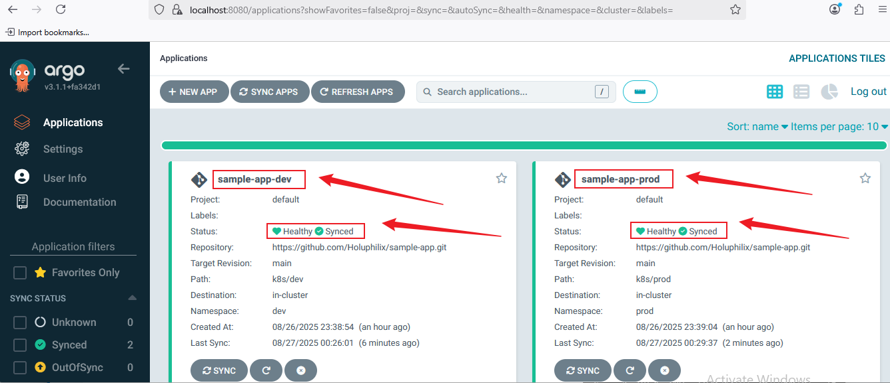
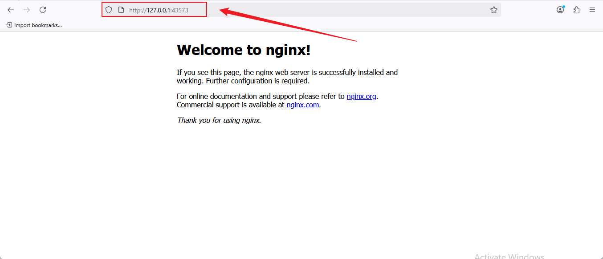

# **Application Deployment and Management with ArgoCD**

## **Project Overview**

This project provides hands-on experience in deploying and managing applications using **ArgoCD** in a Kubernetes environment. Learners will define applications declaratively, manage their lifecycle including syncing and rollbacks, and structure Git repositories for optimal integration with ArgoCD.

## **Why This Project is Relevant**

Modern DevOps practices increasingly rely on GitOps for continuous delivery. ArgoCD is a leading tool in the GitOps ecosystem, allowing teams to maintain **version-controlled, declarative application deployments**. Understanding ArgoCD enhances productivity, ensures consistency across environments, and simplifies Kubernetes application management.

## **Project Goals and Objectives**

* **Define and deploy applications** declaratively with ArgoCD.
* **Manage application lifecycle**, including syncs, rollbacks, and monitoring health.
* **Structure Git repositories** effectively for GitOps workflows.
* Gain practical exposure to **Kubernetes and ArgoCD integration**.

## **Prerequisites**

* Basic knowledge of **Kubernetes** concepts.
* Familiarity with **Git** and version control workflows.
* ArgoCD installed and configured on a Kubernetes cluster.
* **kubectl** and **argocd CLI** installed on the local machine.

## **Project Deliverables**

* A structured project directory with all necessary files.
* Declarative application YAML files.
* Documentation (`README.md`) describing project setup, steps, and best practices.
* Example Git repository structure for managing multiple environments (dev, staging, prod).

## **Tools & Technologies Used**

* **ArgoCD** – Application deployment and lifecycle management.
* **Kubernetes** – Container orchestration platform.
* **Git** – Version control system.
* **kubectl** – Kubernetes command-line tool.
* **YAML** – Configuration files for ArgoCD applications.

## **Project Components**

1. **Project Directory Structure** – Organized folders and files for ArgoCD applications.
2. **Application Definitions** – YAML files defining Kubernetes applications.
3. **Environment-Specific Configurations** – Separate folders or branches for dev, staging, and prod.
4. **Documentation** – README.md and supporting resources.
5. **Images** – Any supporting diagrams, screenshots, or visuals.

## **Task 1: Environment Setup and Project Initialization**

### **Objective:**

Set up the required environment (Minikube, ArgoCD, and GitHub), then create the root project directory with all necessary sub-directories, files, and push the initial structure to GitHub.

### **Steps:**

1. **Set Up Minikube**

   ```bash
   minikube start
   kubectl get nodes
   ```

   **Screenshot:** minikube start
   

2. **Set Up ArgoCD**

   ```bash
   kubectl create namespace argocd
   kubectl apply -n argocd -f https://raw.githubusercontent.com/argoproj/argo-cd/stable/manifests/install.yaml
   ```

   **Screenshot:** kubectl create namespace argocd
   

   Verify installation:

   ```bash
   kubectl get pods -n argocd
   ```

   **Screenshot:** kubectl get pods -n argocd
   

3. **Prepare GitHub Repository**
   Create a new GitHub repository (e.g., `sample-app`) and copy the remote URL.

4. **Create Main Project Directory**

   ```bash
   mkdir argocd-application-project
   cd argocd-application-project
   ```

5. **Create Sub-directories**

   ```bash
   mkdir k8s src images
   ```

6. **Create Environment Directories**

   ```bash
   mkdir -p k8s/dev k8s/prod
   ```

7. **Create Initial README**

   ```bash
   touch README.md
   ```

8. **(Optional) Add Placeholder YAMLs**

   ```bash
   touch k8s/dev/deployment.yaml k8s/prod/deployment.yaml
   ```

9. **Initialize Git and Push to GitHub**

   ```bash
   git init
   git add .
   git commit -m "Initial project setup with directory structure"
   git branch -M main
   git remote add origin https://github.com/Holuphilix/sample-app.git
   git push -u origin main
   ```

   **Screenshot:** Initialize Git and Push
   

10. **Final Directory Structure**

```
argocd-application-project/
│
├── k8s/
│   ├── dev/
│   │   ├── deployment.yaml
│   │   ├── service.yaml
│   │   └── app-definition.yaml
│   ├── prod/
│   │   ├── deployment.yaml
│   │   ├── service.yaml
│   │   └── app-definition.yaml
├── src/
├── images/
│   └── (screenshots for documentation)
└── README.md
```

✅ **Deliverables for Task 1:**

* Minikube running locally
* ArgoCD installed
* GitHub repository linked
* Project directory created and pushed

## **Task 2: Deploy Sample Application with ArgoCD**

### **Objective:**

Deploy the sample application to Minikube using ArgoCD with environment-specific manifests (`dev` and `prod`) and version control via GitHub.

### **Steps:**

1. **Create Namespaces**

   ```bash
   kubectl create namespace dev
   kubectl create namespace prod
   ```

   **Screenshot:** Namespaces created
   

2. **Create Kubernetes Services**

   **2.1 Dev environment:** `k8s/dev/service.yaml`

```yaml
apiVersion: v1
kind: Service
metadata:
  name: sample-app-service
spec:
  selector:
    app: sample-app
  ports:
    - protocol: TCP
      port: 80
      targetPort: 3000
  type: NodePort
```

**2.2 Prod environment:** `k8s/prod/service.yaml`

```yaml
apiVersion: v1
kind: Service
metadata:
  name: sample-app-service
spec:
  selector:
    app: sample-app
  ports:
    - protocol: TCP
      port: 80
      targetPort: 3000
  type: NodePort
```

3. **Update Deployment YAMLs**

   **3.1 Dev environment:** `k8s/dev/deployment.yaml`

```yaml
apiVersion: apps/v1
kind: Deployment
metadata:
  name: sample-app
spec:
  replicas: 1
  selector:
    matchLabels:
      app: sample-app
  template:
    metadata:
      labels:
        app: sample-app
    spec:
      containers:
        - name: sample-app
          image: holuphilix/sample-app:latest
          ports:
            - containerPort: 3000
```

**3.2 Prod environment:** `k8s/prod/deployment.yaml`

```yaml
apiVersion: apps/v1
kind: Deployment
metadata:
  name: sample-app
spec:
  replicas: 2
  selector:
    matchLabels:
      app: sample-app
  template:
    metadata:
      labels:
        app: sample-app
    spec:
      containers:
        - name: sample-app
          image: holuphilix/sample-app:latest
          ports:
            - containerPort: 3000
```

4. **Create ArgoCD Applications**

   **4.1 Dev:** `k8s/dev/app-definition.yaml`

```yaml
apiVersion: argoproj.io/v1alpha1
kind: Application
metadata:
  name: sample-app-dev
  namespace: argocd
spec:
  project: default
  source:
    repoURL: https://github.com/Holuphilix/sample-app.git
    targetRevision: main
    path: k8s/dev
  destination:
    server: https://kubernetes.default.svc
    namespace: dev
  syncPolicy:
    automated:
      prune: true
      selfHeal: true
```

**4.2 Prod:** `k8s/prod/app-definition.yaml`

```yaml
apiVersion: argoproj.io/v1alpha1
kind: Application
metadata:
  name: sample-app-prod
  namespace: argocd
spec:
  project: default
  source:
    repoURL: https://github.com/Holuphilix/sample-app.git
    targetRevision: main
    path: k8s/prod
  destination:
    server: https://kubernetes.default.svc
    namespace: prod
  syncPolicy:
    automated:
      prune: true
      selfHeal: true
```

5. **Apply ArgoCD Applications**

```bash
kubectl apply -f k8s/dev/app-definition.yaml
kubectl apply -f k8s/prod/app-definition.yaml
```

**Screenshot:** Applications applied


6. **Verify Deployment**

```bash
kubectl port-forward svc/argocd-server -n argocd 8080:443
```

* Access ArgoCD UI at [https://localhost:8080](https://localhost:8080)
* Get admin password:

```bash
kubectl get secret argocd-initial-admin-secret -n argocd -o jsonpath="{.data.password}" | base64 -d; echo
```

**Screenshot:** Verify Apps


7. **Commit and Push**

```bash
git add k8s/dev k8s/prod
git commit -m "Add dev and prod deployment, service, and ArgoCD application manifests"
git push origin main
```

✅ **Deliverables for Task 2:**

* `service.yaml`, `deployment.yaml`, `app-definition.yaml` for dev & prod
* Running applications in ArgoCD
* Verified through ArgoCD UI and CLI
* GitHub updated

## **Task 3: Manage Application Lifecycle with ArgoCD**

### **Objective:**

Learn to **sync**, **monitor health**, and manage ArgoCD application lifecycle.

### **Steps:**

1. **Sync the Application**

   **3.1 Dev:**

```bash
argocd app sync sample-app-dev
```

**Screenshot:**


**3.2 Prod:**

```bash
argocd app sync sample-app-prod
```

**Screenshot:**


2. **Monitor Health and Status**

   **3.1 Dev:**

```bash
argocd app get sample-app-dev
```

**Screenshot:**


**3.2 Prod:**

```bash
argocd app get sample-app-prod
```

**Screenshot:**


3. **Commit & Push Updates**

```bash
git add k8s/dev k8s/prod
git commit -m "Update application lifecycle management configuration"
git push origin main
```

✅ **Deliverables for Task 3:**

* Applications synced in dev & prod
* Health and sync status verified
* Git repository updated

## **Task 4: Deploy and Access Nginx Application**

### **Objective:**

Update Kubernetes manifests for dev and prod environments, deploy the Nginx application via ArgoCD, and ensure external access to the app.

### **Steps:**

1. **Update Deployment Manifests**

   **1.1 Prod `deployment.yaml`:**

   ```yaml
   apiVersion: apps/v1
   kind: Deployment
   metadata:
     name: sample-app
     labels:
       app: sample-app
       environment: prod
   spec:
     replicas: 3
     selector:
       matchLabels:
         app: sample-app
     template:
       metadata:
         labels:
           app: sample-app
           environment: prod
       spec:
         containers:
           - name: sample-app
             image: nginx:1.27.2-alpine
             imagePullPolicy: IfNotPresent
             ports:
               - containerPort: 80
             resources:
               requests:
                 cpu: "100m"
                 memory: "128Mi"
               limits:
                 cpu: "250m"
                 memory: "256Mi"
             livenessProbe:
               httpGet:
                 path: /
                 port: 80
               initialDelaySeconds: 15
               periodSeconds: 20
             readinessProbe:
               httpGet:
                 path: /
                 port: 80
               initialDelaySeconds: 5
               periodSeconds: 10
     strategy:
       type: RollingUpdate
       rollingUpdate:
         maxSurge: 1
         maxUnavailable: 1
   ```

   **1.2 Dev `deployment.yaml`:**

   ```yaml
   apiVersion: apps/v1
   kind: Deployment
   metadata:
     name: sample-app
     labels:
       app: sample-app
       environment: dev
   spec:
     replicas: 2
     selector:
       matchLabels:
         app: sample-app
     template:
       metadata:
         labels:
           app: sample-app
           environment: dev
       spec:
         containers:
           - name: sample-app
             image: nginx:1.27.2-alpine
             imagePullPolicy: IfNotPresent
             ports:
               - containerPort: 80
             resources:
               requests:
                 cpu: "50m"
                 memory: "64Mi"
               limits:
                 cpu: "150m"
                 memory: "128Mi"
             livenessProbe:
               httpGet:
                 path: /
                 port: 80
               initialDelaySeconds: 10
               periodSeconds: 15
             readinessProbe:
               httpGet:
                 path: /
                 port: 80
               initialDelaySeconds: 3
               periodSeconds: 8
     strategy:
       type: RollingUpdate
       rollingUpdate:
         maxSurge: 1
         maxUnavailable: 1
   ```

2. **Update Service Manifests**

   **2.1 Dev `service.yaml`:**

   ```yaml
   apiVersion: v1
   kind: Service
   metadata:
     name: sample-app-service
     labels:
       app: sample-app
   spec:
     selector:
       app: sample-app
     type: NodePort
     ports:
       - protocol: TCP
         port: 80
         targetPort: 80
         nodePort: 31139
   ```

   **2.2 Prod `service.yaml`:**

   ```yaml
   apiVersion: v1
   kind: Service
   metadata:
     name: sample-app-service
     labels:
       app: sample-app
   spec:
     selector:
       app: sample-app
     type: NodePort
     ports:
       - protocol: TCP
         port: 80
         targetPort: 80
         nodePort: 32561
   ```

3. **Commit and Push Changes**

   ```bash
   git add k8s/dev/deployment.yaml k8s/dev/service.yaml
   git add k8s/prod/deployment.yaml k8s/prod/service.yaml
   git commit -m "Update Nginx deployment and service manifests for Task 4"
   git push origin main
   ```

4. **Sync Applications with ArgoCD**

   **4.1 Dev environment:**

   ```bash
   argocd app sync sample-app-dev
   argocd app get sample-app-dev
   ```

   **4.2 Prod environment:**

   ```bash
   argocd app sync sample-app-prod
   argocd app get sample-app-prod
   ```

   **Screenshot:** Verify both **sync status** and **health status**
   

5. **Access Nginx Application**

   **5.1 Use Minikube service command:**

   ```bash
   minikube service sample-app-service -n prod
   ```

   **5.2 Example URLs:**

   * Prod: `http://127.0.0.1:43573`
   

   **Screenshot:** Nginx Application
   

6. **Verify Pods and Services**

   ```bash
   kubectl get pods -n dev
   kubectl get pods -n prod
   kubectl get svc -n dev
   kubectl get svc -n prod
   ```

   **Explanation:**

   * Ensure all pods are **Running**.
   * Confirm services expose the correct **NodePort**.

### **Deliverables for Task 4**

* Updated `deployment.yaml` and `service.yaml` files for dev and prod.
* Applications synced via ArgoCD for both environments.
* Nginx app accessible externally via NodePort.
* Verified pod and service statuses.
* Git repository updated with changes.

## **Task 5: Cleanup Environment (Optional but Recommended)**

### **Objective:**

Clean up Kubernetes resources, ArgoCD applications, and local Minikube environment to free up resources and maintain a tidy workspace.

### **Steps:**

1. **Delete ArgoCD Applications (if no longer needed):**

```bash
argocd app delete sample-app-dev --yes
argocd app delete sample-app-prod --yes
```

2. **Delete Kubernetes Namespaces (if used for testing):**

```bash
kubectl delete namespace dev
kubectl delete namespace prod
```

3. **Stop and Delete Minikube Cluster:**

```bash
minikube stop
minikube delete
```

### **Explanation:**

Cleaning up ensures:

* No unused resources consume CPU, memory, or storage.
* Future deployments are not affected by leftover pods, services, or namespaces.
* Your Minikube and local environment stay stable and clean.

## **Conclusion**

In this project, we successfully implemented a full **GitOps workflow** using **ArgoCD** to manage Kubernetes applications in both **dev** and **prod** environments. The key achievements include:

* Creating and updating **modular Kubernetes manifests** (`deployment.yaml` and `service.yaml`) for Nginx applications.
* Syncing applications via **ArgoCD** to maintain a desired state defined in Git.
* Ensuring **application health and readiness** using liveness and readiness probes.
* Deploying Nginx applications in **Minikube** environments and verifying external access via **NodePort**.
* Maintaining a clean **GitOps workflow** by committing and pushing all changes to the repository.


## **Final Git Push Repo**

After completing all updates and verification steps, ensure all changes are committed and pushed to Git:

```bash
# Stage all changes
git add.

# Commit with a descriptive message
git commit -m "Finalize Task 4: Nginx deployment and service manifests, synced via ArgoCD"

# Push to remote repository
git push origin main
```

> **Note:** Keeping the repository up-to-date ensures ArgoCD can track the latest desired state and maintain a consistent GitOps workflow.

## **Author**

**Philip Oluwaseyi Oludolamu**

* Email: [oluphilix@gmail.com](mailto:oluphilix@gmail.com)
* Phone: +905338763067
* LinkedIn: [Philip Oludolamu](https://www.linkedin.com/in/oluphilix)
* GitHub: [Holuphilix](https://github.com/Holuphilix)

**About the Author:**
A DevOps Engineer with practical experience in **Kubernetes, ArgoCD, Terraform, Docker, and CI/CD pipelines**, passionate about delivering automated and scalable cloud-native applications.

