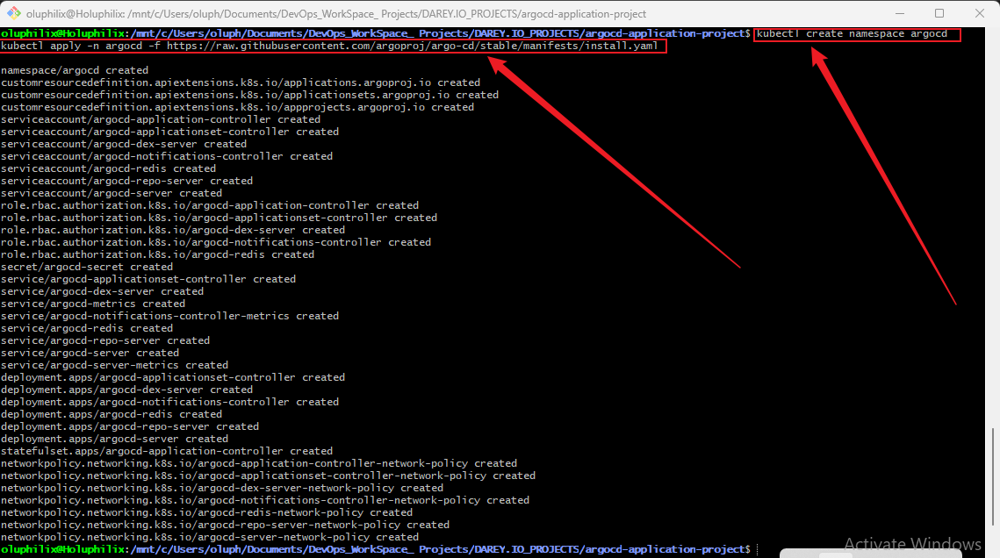
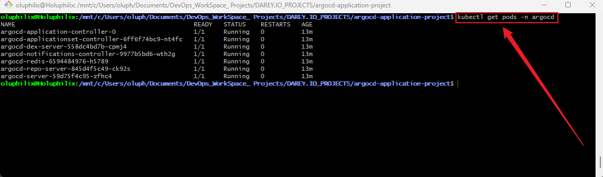

# **Application Deployment and Management with ArgoCD**

## **Project Overview**

This project provides hands-on experience in deploying and managing applications using **ArgoCD** in a Kubernetes environment. Learners will define applications declaratively, manage their lifecycle including syncing and rollbacks, and structure Git repositories for optimal integration with ArgoCD.

## **Why This Project is Relevant**

Modern DevOps practices increasingly rely on GitOps for continuous delivery. ArgoCD is a leading tool in the GitOps ecosystem, allowing teams to maintain **version-controlled, declarative application deployments**. Understanding ArgoCD enhances productivity, ensures consistency across environments, and simplifies Kubernetes application management.

## **Project Goals and Objectives**

* **Define and deploy applications** declaratively with ArgoCD.
* **Manage application lifecycle**, including syncs, rollbacks, and monitoring health.
* **Structure Git repositories** effectively for GitOps workflows.
* Gain practical exposure to **Kubernetes and ArgoCD integration**.

## **Prerequisites**

* Basic knowledge of **Kubernetes** concepts.
* Familiarity with **Git** and version control workflows.
* ArgoCD installed and configured on a Kubernetes cluster.
* **kubectl** and **argocd CLI** installed on the local machine.

## **Project Deliverables**

* A structured project directory with all necessary files.
* Declarative application YAML files.
* Documentation (`README.md`) describing project setup, steps, and best practices.
* Example Git repository structure for managing multiple environments (dev, staging, prod).

## **Tools & Technologies Used**

* **ArgoCD** – Application deployment and lifecycle management.
* **Kubernetes** – Container orchestration platform.
* **Git** – Version control system.
* **kubectl** – Kubernetes command-line tool.
* **YAML** – Configuration files for ArgoCD applications.

## **Project Components**

1. **Project Directory Structure** – Organized folders and files for ArgoCD applications.
2. **Application Definitions** – YAML files defining Kubernetes applications.
3. **Environment-Specific Configurations** – Separate folders or branches for dev, staging, and prod.
4. **Documentation** – README.md and supporting resources.
5. **Images** – Any supporting diagrams, screenshots, or visuals.

## **Task 1: Environment Setup and Project Initialization**

### **Objective:**

Set up the required environment (Minikube, ArgoCD, and GitHub), then create the root project directory with all necessary sub-directories, files, and push the initial structure to GitHub.

### **Steps:**

1. **Set Up Minikube**
   Install and start Minikube as the local Kubernetes cluster:

   ```bash
   minikube start
   kubectl get nodes
   ```

    **Screenshot:** minikube start
    

2. **Set Up ArgoCD**
   Install ArgoCD in the cluster:

   ```bash
   kubectl create namespace argocd
   kubectl apply -n argocd -f https://raw.githubusercontent.com/argoproj/argo-cd/stable/manifests/install.yaml
   ```
    **Screenshot:** kubectl create namespace argocd
    


   Verify installation:

   ```bash
   kubectl get pods -n argocd
   ```
    **Screenshot:** kubectl get pods -n argocd
    

3. **Prepare GitHub Repository**
   Create a new GitHub repository (e.g., `sample-app`) where all project files will be pushed. Copy the remote URL.

4. **Create the Main Project Directory**

   ```bash
   mkdir argocd-application-project
   cd argocd-application-project
   ```

5. **Create Essential Sub-directories**

   ```bash
   mkdir k8s src images
   ```

6. **Create Environment-specific Directories inside `k8s`**

   ```bash
   mkdir -p k8s/dev k8s/prod
   ```

7. **Create an Initial `README.md` File**

   ```bash
   touch README.md
   ```

8. **(Optional) Add Placeholders for YAML Files**

   ```bash
   touch k8s/dev/deployment.yaml k8s/prod/deployment.yaml
   ```

9. **Initialize Git and Push to GitHub**

   ```bash
   git init
   git add .
   git commit -m "Initial project setup with directory structure"
   git branch -M main
   git remote add origin https://github.com/Holuphilix/sample-app.git
   git push -u origin main
   ```

10. **Final Directory Structure Should Look Like:**

```
argocd-application-project/
├── k8s/
│   ├── dev/
│   │   └── deployment.yaml
│   └── prod/
│       └── deployment.yaml
├── src/
├── images/
└── README.md
```

✅ **Deliverable for Task 1:**

* Minikube running locally
* ArgoCD installed in the cluster
* GitHub repository created and linked
* Fully created project directory with required sub-directories, placeholder YAML files, and initial commit pushed to GitHub
