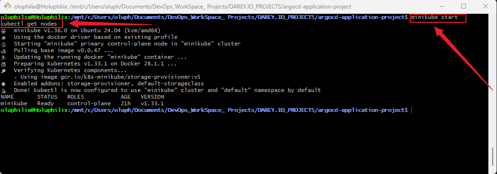

# **Application Deployment and Management with ArgoCD**

## **Project Overview**

This project provides hands-on experience in deploying and managing applications using **ArgoCD** in a Kubernetes environment. Learners will define applications declaratively, manage their lifecycle including syncing and rollbacks, and structure Git repositories for optimal integration with ArgoCD.

## **Why This Project is Relevant**

Modern DevOps practices increasingly rely on GitOps for continuous delivery. ArgoCD is a leading tool in the GitOps ecosystem, allowing teams to maintain **version-controlled, declarative application deployments**. Understanding ArgoCD enhances productivity, ensures consistency across environments, and simplifies Kubernetes application management.

## **Project Goals and Objectives**

* **Define and deploy applications** declaratively with ArgoCD.
* **Manage application lifecycle**, including syncs, rollbacks, and monitoring health.
* **Structure Git repositories** effectively for GitOps workflows.
* Gain practical exposure to **Kubernetes and ArgoCD integration**.

## **Prerequisites**

* Basic knowledge of **Kubernetes** concepts.
* Familiarity with **Git** and version control workflows.
* ArgoCD installed and configured on a Kubernetes cluster.
* **kubectl** and **argocd CLI** installed on the local machine.

## **Project Deliverables**

* A structured project directory with all necessary files.
* Declarative application YAML files.
* Documentation (`README.md`) describing project setup, steps, and best practices.
* Example Git repository structure for managing multiple environments (dev, staging, prod).

## **Tools & Technologies Used**

* **ArgoCD** – Application deployment and lifecycle management.
* **Kubernetes** – Container orchestration platform.
* **Git** – Version control system.
* **kubectl** – Kubernetes command-line tool.
* **YAML** – Configuration files for ArgoCD applications.

## **Project Components**

1. **Project Directory Structure** – Organized folders and files for ArgoCD applications.
2. **Application Definitions** – YAML files defining Kubernetes applications.
3. **Environment-Specific Configurations** – Separate folders or branches for dev, staging, and prod.
4. **Documentation** – README.md and supporting resources.
5. **Images** – Any supporting diagrams, screenshots, or visuals.

## **Task 1: Environment Setup and Project Initialization**

### **Objective:**

Set up the required environment (Minikube, ArgoCD, and GitHub), then create the root project directory with all necessary sub-directories, files, and push the initial structure to GitHub.

### **Steps:**

1. **Set Up Minikube**
   Install and start Minikube as the local Kubernetes cluster:

   ```bash
   minikube start
   kubectl get nodes
   ```

    **Screenshot:** minikube start
    

2. **Set Up ArgoCD**
   Install ArgoCD in the cluster:

   ```bash
   kubectl create namespace argocd
   kubectl apply -n argocd -f https://raw.githubusercontent.com/argoproj/argo-cd/stable/manifests/install.yaml
   ```
    **Screenshot:** kubectl create namespace argocd
    


   Verify installation:

   ```bash
   kubectl get pods -n argocd
   ```
    **Screenshot:** kubectl get pods -n argocd
    

3. **Prepare GitHub Repository**
   Create a new GitHub repository (e.g., `sample-app`) where all project files will be pushed. Copy the remote URL.

4. **Create the Main Project Directory**

   ```bash
   mkdir argocd-application-project
   cd argocd-application-project
   ```

5. **Create Essential Sub-directories**

   ```bash
   mkdir k8s src images
   ```

6. **Create Environment-specific Directories inside `k8s`**

   ```bash
   mkdir -p k8s/dev k8s/prod
   ```

7. **Create an Initial `README.md` File**

   ```bash
   touch README.md
   ```

8. **(Optional) Add Placeholders for YAML Files**

   ```bash
   touch k8s/dev/deployment.yaml k8s/prod/deployment.yaml
   ```

9. **Initialize Git and Push to GitHub**

   ```bash
   git init
   git add .
   git commit -m "Initial project setup with directory structure"
   git branch -M main
   git remote add origin https://github.com/Holuphilix/sample-app.git
   git push -u origin main
   ```

      **Screenshot:** Initialize Git and Push to GitHub
      

10. **Final Directory Structure Should Look Like:**

```
argocd-application-project/
├── k8s/
│   ├── dev/
│   │   └── deployment.yaml
│   └── prod/
│       └── deployment.yaml
├── src/
├── images/
└── README.md
```

✅ **Deliverable for Task 1:**

* Minikube running locally
* ArgoCD installed in the cluster
* GitHub repository created and linked
* Fully created project directory with required sub-directories, placeholder YAML files, and initial commit pushed to GitHub


## **Task 2: Deploy Sample Application with ArgoCD**

### **Objective:**

Deploy the sample application to the Minikube cluster using ArgoCD, leveraging environment-specific manifests (`dev` and `prod`) and ensure the app is version-controlled via GitHub.

### **Steps:**

1. **Create Namespaces**

```bash
kubectl create namespace dev
kubectl create namespace prod
```

**Screenshot:** Create Namespaces for dev & prod


**Explanation:**
Namespaces separate environments and allow ArgoCD to manage them independently.

2. **Create Kubernetes Service**

**2.1 Dev environment:** `k8s/dev/service.yaml`

```yaml
apiVersion: v1
kind: Service
metadata:
  name: sample-app-service
spec:
  selector:
    app: sample-app
  ports:
    - protocol: TCP
      port: 80
      targetPort: 3000
  type: NodePort
```

**2.2 Prod environment:** `k8s/prod/service.yaml`

```yaml
apiVersion: v1
kind: Service
metadata:
  name: sample-app-service
spec:
  selector:
    app: sample-app
  ports:
    - protocol: TCP
      port: 80
      targetPort: 3000
  type: NodePort
```

**Explanation:**
Exposes the application in the cluster. `NodePort` allows external access. Adjust `targetPort` if your container uses a different port.

3. **Update Deployment YAML**

**3.1 Dev environment:** `k8s/dev/deployment.yaml`

```yaml
apiVersion: apps/v1
kind: Deployment
metadata:
  name: sample-app
spec:
  replicas: 1
  selector:
    matchLabels:
      app: sample-app
  template:
    metadata:
      labels:
        app: sample-app
    spec:
      containers:
        - name: sample-app
          image: holuphilix/sample-app:latest
          ports:
            - containerPort: 3000
```

**3.2 Prod environment:** `k8s/prod/deployment.yaml`

```yaml
apiVersion: apps/v1
kind: Deployment
metadata:
  name: sample-app
spec:
  replicas: 2
  selector:
    matchLabels:
      app: sample-app
  template:
    metadata:
      labels:
        app: sample-app
    spec:
      containers:
        - name: sample-app
          image: holuphilix/sample-app:latest
          ports:
            - containerPort: 3000
```

**Explanation:**

* Dev uses 1 replica, Prod uses 2 replicas for higher availability.
* Container image and port must match the actual application.

4. **Create ArgoCD Application Manifests**

**4.1 Dev environment:** `k8s/dev/app-definition.yaml`

```yaml
apiVersion: argoproj.io/v1alpha1
kind: Application
metadata:
  name: sample-app-dev
  namespace: argocd
spec:
  project: default
  source:
    repoURL: https://github.com/Holuphilix/sample-app.git
    targetRevision: main
    path: k8s/dev
  destination:
    server: https://kubernetes.default.svc
    namespace: dev
  syncPolicy:
    automated:
      prune: true
      selfHeal: true
```

**4.2 Prod environment:** `k8s/prod/app-definition.yaml`

```yaml
apiVersion: argoproj.io/v1alpha1
kind: Application
metadata:
  name: sample-app-prod
  namespace: argocd
spec:
  project: default
  source:
    repoURL: https://github.com/Holuphilix/sample-app.git
    targetRevision: main
    path: k8s/prod
  destination:
    server: https://kubernetes.default.svc
    namespace: prod
  syncPolicy:
    automated:
      prune: true
      selfHeal: true
```

**Explanation:**

* Dev and Prod applications are separated for independent management.
* `prune: true` removes resources deleted in Git.
* `selfHeal: true` automatically corrects drift from desired state.

5. **Apply ArgoCD Applications**

```bash
kubectl apply -f k8s/dev/app-definition.yaml
kubectl apply -f k8s/prod/app-definition.yaml
```

**Screenshot:** Apply ArgoCD Applications


**Explanation:**
Registers both applications with ArgoCD and starts deployment.

6. **Verify Deployment**

1. Forward the ArgoCD server port:

```bash
kubectl port-forward svc/argocd-server -n argocd 8080:443
```

**Screenshot:** Forward the ArgoCD server port


2. Access ArgoCD UI at [https://localhost:8080](https://localhost:8080) and log in with admin credentials.

3. Get ArgoCD Admin Password:

```bash
kubectl get secret argocd-initial-admin-secret -n argocd -o jsonpath="{.data.password}" | base64 -d; echo
```

**Screenshot:** Get ArgoCD Admin Password


4. Confirm that **sample-app-dev** and **sample-app-prod** are **Synced** and **Healthy**.

**Screenshot:** Sample app Synced and Healthy


7. **Commit and Push to GitHub**

```bash
git add k8s/dev k8s/prod
git commit -m "Add dev and prod deployment, service, and ArgoCD application manifests"
git push origin main
```

**Explanation:**
Keeps ArgoCD in sync with Git for proper GitOps workflow.

### **Deliverables for Task 2**

* `service.yaml`, `deployment.yaml`, and `app-definition.yaml` for both **dev** and **prod** environments.
* Running applications managed by ArgoCD in **dev** and **prod** namespaces.
* Verified deployments through ArgoCD UI and CLI.
* GitHub repository updated with all environment manifests.


Got it 👍 I’ll extend your **Task 3** to also include **accessing the Nginx app** after deployment. Here’s the updated version:

---

## **Task 3: Manage Application Lifecycle with ArgoCD**

### **Objective:**

Learn how to manage the application lifecycle in ArgoCD, including **syncing**, **monitoring health**, and **accessing the Nginx app** for both **dev** and **prod** environments.

### **Steps:**

1. **Sync the Application**

   Synchronize the application state in ArgoCD to match the Git repository:

   **3.1 Dev environment:**

   ```bash
   argocd app sync sample-app-dev
   ```

   **Screenshot:** Sync the Application Dev
   

   **3.2 Prod environment:**

   ```bash
   argocd app sync sample-app-prod
   ```

   **Screenshot:** Sync the Application Prod
   

   **Explanation:**
   Syncing ensures that the Kubernetes cluster reflects the **desired state** defined in Git.

2. **Monitor Health and Status**

   Check the status and health of applications:

   **3.1 Dev environment:**

   ```bash
   argocd app get sample-app-dev
   ```

   **Screenshot:** App Get Dev
   

   **3.2 Prod environment:**

   ```bash
   argocd app get sample-app-prod
   ```

   **Screenshot:** App Get Prod
   

   **Explanation:**
   This command shows **sync status**, **health status**, and other details to confirm the application is running as expected.

   **Screenshot:** ArgoCD App Status
   

3. **Access the Nginx Application**

   Once the application is synced and healthy, you can access the running **Nginx app**:

   * **For Dev (NodePort in Minikube):**

     ```bash
     minikube service sample-app-service-dev -n dev
     ```

     This will open the service in your default browser.

   * **For Prod (LoadBalancer in cloud or NodePort in Minikube):**

     ```bash
     kubectl get svc sample-app-service-prod -n prod
     ```

     * If using **Minikube**, access via:

       ```
       http://<Minikube-IP>:<NodePort>
       ```
     * If using **cloud provider (AWS/GCP/Azure)**, copy the **EXTERNAL-IP** and open:

       ```
       http://<EXTERNAL-IP>
       ```

   **Explanation:**
   This confirms the deployed Nginx container is accessible externally and serving traffic.


5. **Commit and Push Changes (if any updates)**

   If you make updates to YAML or ArgoCD manifests, ensure changes are committed to Git:

   ```bash
   git add k8s/dev k8s/prod
   git commit -m "Update application lifecycle management, rollback, and service exposure"
   git push origin main
   ```

   **Explanation:**
   Keeping Git updated ensures ArgoCD can **track the latest desired state** and maintain GitOps workflow.

### **Deliverables for Task 3**

* Applications synced with the Git repository for **dev** and **prod** environments.
* Verified **health status** and **sync status** for both environments using ArgoCD CLI/UI.
* Rollback functionality tested and documented.
* Verified **Nginx app access** via Minikube (NodePort) or cloud (LoadBalancer).
* Git repository updated with any lifecycle management changes.

